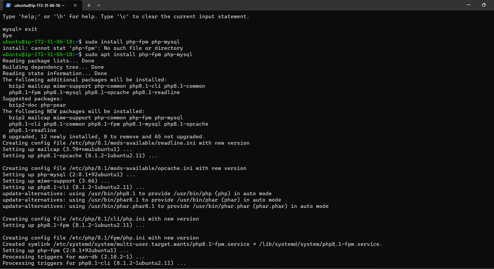

# Awesome documentation of project 2: LEMP Stack Implementation: NGINX Web Server Stack Implementation.

### Step1: Installation of the NGINX Web Server 
#### Nginx is a high-performance web server and i used the apt package manager to install this package.The cmd used is the "sudo apt install nginx"

### Part2: Confirmation of the NGINX Web-server 

#### This is to confirm that the NGINX Web -Server was successfully installed after which running the "sudo apt install nginx" was exxcuted. In this case we are using the unbutu instance from  the aws console.

## Step2: Installation of Mysql

#### We would be installing a database which would be used to store and manage data for my site. And in this case i would be using Mysql Database.

 

### Part2: Confirmation of Mysql:

In this case there is confirmation of my installation of MySql.

## Step 3: Installing of PHP  

i would be installing PHP to process code and generate dynamic content for the web server. This would allow for a better overall performanceand add configuration.

 

## Step 4: Configuring nginx to use PHP Processor.

The NGINX Webserver, is used to create server blocks which is used to encapsulate configuration details and host more than one domain on a server.

 

### Part 2: Website successfully launched on the browser.

 

#### Step 5: Retrieving data from mysql database with PHP

#### Created a database which i named First_Database and also i created a User named First_user, after creating the user and granted full priviledges on the database.

### Part 1: Success testing PhP with NGINX Server.

At this point, My LAMP stack is completely installed and fully operational.

Am testing it to validate that Nginx can correctly hand .php files off to your PHP processor which i did by creating a test PHP file in my document root and after i Open a new file called grabs.php within your document root in my text editor.

### Part 2: successfully retrieving data from database.

In this i create a test database (DB) with simple "To do list" and configure access to it, so the Nginx website would be able to query data from the DB and display it on the browser.

 

 